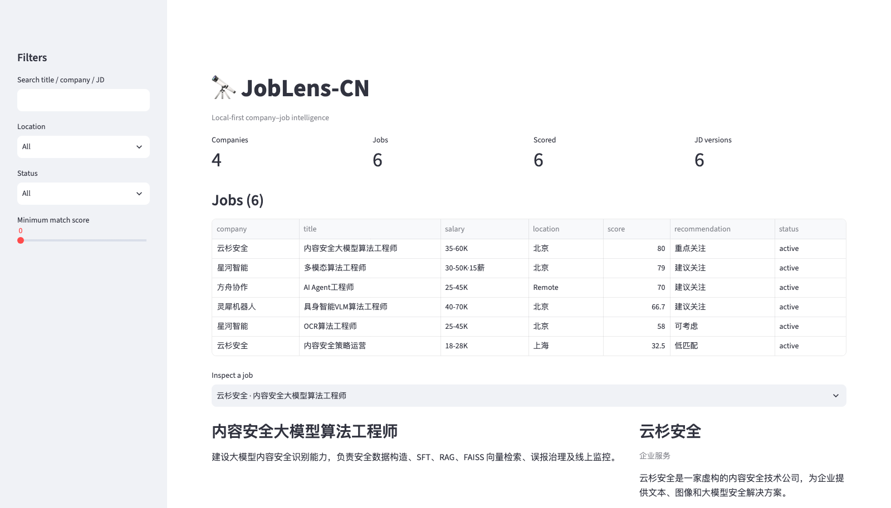
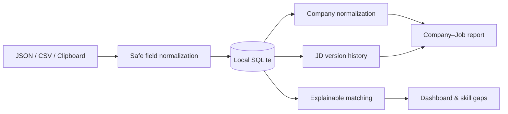

# JobLens-CN 🔭

> Local-first company–job intelligence for Chinese tech candidates.

JobLens-CN 把零散岗位整理为可维护的“公司—岗位—JD”数据：导入 JSON/CSV，自动完成公司归一化、岗位去重、JD 版本追踪、可解释匹配，并生成本地 Dashboard 与 Markdown 报告。

数据默认保存在本地 SQLite 中。项目不内置任何招聘平台爬虫，不要求上传简历，也不附带真实招聘数据。



## 为什么是 JobLens

- **公司—岗位关系**：从孤立的职位链接升级为可查询的公司岗位库。
- **JD 版本追踪**：同一岗位发生变化时自动保存新版本，可查看文本差异。
- **可解释匹配**：展示命中技能、技能缺口、方向与地点证据，不只给一个黑盒分数。
- **来源无关**：支持规范 JSON、常见字段 JSON 和 CSV，方便接入合规数据源。
- **本地优先**：SQLite、简历画像和报告均保存在用户机器上。
- **安全导出**：只导出公开字段，不保留 Cookie、请求令牌或浏览器状态。

## 30 秒体验

```bash
git clone https://github.com/Linranran/JobLens-CN.git
cd JobLens-CN
python3 -m venv .venv
source .venv/bin/activate
pip install -e .
joblens demo
```

输出：

```text
demo-output/
├── joblens.db
├── company_job_report.md
└── jobs_export.json
```

可选 Dashboard：

```bash
pip install -e '.[dashboard]'
joblens dashboard --db demo-output/joblens.db
```

## 工作流



## 使用自己的数据

初始化并导入：

```bash
joblens init
joblens import jobs.json
joblens import jobs.csv
```

如果数据工具分别导出岗位列表和详情 JSON，可先离线合并、清洗并预览：

```bash
joblens import-bundle jobs.json \
  --details details.json \
  --source manual-json \
  --dry-run

joblens import-bundle jobs.json \
  --details details.json \
  --source manual-json
```

`import-bundle` 按来源岗位 ID 合并两个文件，移除请求令牌、内部加密 ID、招聘者状态等字段，并记录本次导入的新增、更新、未变化和缺少详情数量。原始文件建议只放在被 Git 忽略的 `data/private/` 中。

使用本地候选人画像评分：

```bash
cp examples/profile.example.json profile.json
joblens score --profile profile.json
joblens report --output out/company_job_report.md
```

查询统计与 JD 变化：

```bash
joblens stats
joblens history job_xxxxxxxxxxxxxxxx
joblens export --output out/jobs.json
```

## 最小输入格式

```json
{
  "jobs": [
    {
      "source": "manual",
      "external_id": "role-001",
      "company_name": "示例科技",
      "title": "多模态算法工程师",
      "location": "北京",
      "skills": ["Python", "PyTorch", "VLM"],
      "description": "岗位描述……",
      "source_url": "https://example.com/jobs/role-001"
    }
  ]
}
```

也兼容 `company`、`boss_name`、`jd`、`job_link`、`skill_tags` 等常见字段名，但只会写入公开安全字段。字段定义见 [数据模型](docs/data-model.md)。

## 命令

| 命令 | 用途 |
|---|---|
| `joblens init` | 初始化 SQLite 数据库 |
| `joblens import FILE` | 导入 JSON 或 CSV |
| `joblens import-bundle FILE --details FILE` | 合并并清洗离线列表/详情 JSON |
| `joblens imports` | 查看最近的导入批次 |
| `joblens score --profile FILE` | 运行可解释匹配 |
| `joblens report` | 生成公司—岗位 Markdown 报告 |
| `joblens history JOB_ID` | 查看最近两版 JD 的差异 |
| `joblens export` | 导出安全规范 JSON |
| `joblens dashboard` | 启动可选本地 Dashboard |
| `joblens demo` | 用合成数据生成完整演示 |

## 隐私与合规

- 请仅导入你有权处理的数据，并遵守数据源的服务条款与适用法律。
- 不要提交 Cookie、登录态、请求令牌、私人沟通记录或包含个人信息的页面快照。
- `data/raw/`、`data/private/`、`resumes/`、数据库和浏览器状态默认被 Git 忽略。
- `examples/` 中的公司、岗位和链接均为合成示例。
- JobLens-CN 不提供自动投递或绕过网站访问控制的功能。

更多说明见 [安全政策](SECURITY.md) 与 [连接器设计](docs/connectors.md)。

## Roadmap

- [x] JSON/CSV 导入与字段白名单
- [x] SQLite 公司—岗位关系
- [x] JD 版本追踪与 Diff
- [x] 可解释规则匹配
- [x] Markdown 报告
- [x] 本地 Streamlit Dashboard
- [ ] BM25 / Embedding 可选语义匹配
- [ ] Greenhouse、Lever、Ashby 公共职位源连接器
- [x] 离线列表/详情双文件合并与导入审计
- [ ] 投递状态与面试流程看板
- [ ] 中英文界面
- [ ] 可选本地 LLM 分析

## 开发

```bash
pip install -e '.[dev]'
ruff check .
pytest
```

欢迎提交 Issue 和 PR。适合第一次贡献的方向包括新增导入器、补充技能词表、改进中文匹配和完善 Dashboard。

## License

[MIT](LICENSE)
